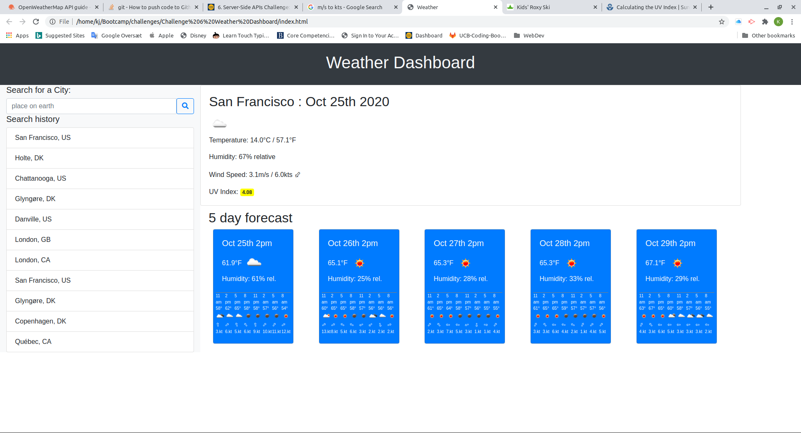

# Weather Dashboard
This is a weather dashbord page that shows the current weater and forecast for a city or place of your choice.

## OpenWeater API
The openweathermap API is used for this page, for it to work you should to get your own API key (I have yet to learn to serve it up for you..)

Find the page here:

https://kjwesthoff.github.io/WeatherDashboard/

## Features
### Search
* You can search for a city, and if it exists (i.e. can be found by openweather) The current weather and forecast is shown. 
* The search is added to the top of the search history and saved in local storage for future visits. 
    * You can re-visit your viewed places by clicking on the city in the history.
    * When a city is re-vistited it is placed at the top of your search history
    * Duplicates are removed from the list, the latest search is placed at the top   
### Current Weather
The current weathter is shown with
* A weather icon
* Temperature in C and F
* Realtive humidity %
* Wind Speed in m/s and knots
    * The wind direction is shown relative to north with an arrow
* A the current UV index is shown with a colorcoding according to https://www.epa.gov/sunsafety/calculating-uv-index-0

### Weather Forecast
* Temperature weather icon and humidity is shown for the next five 2pm times of the future. 
* The development of weather type(icon) temperature windspeed and direction is shown in for 3 hr intervals in the forthcoming 5 days.

Here is a picture:

